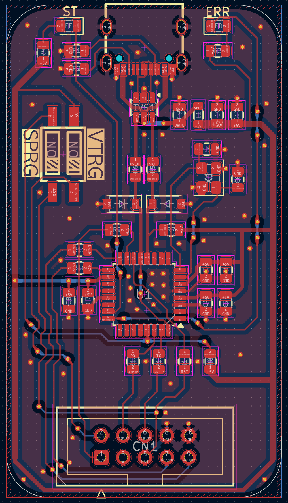

# USBCasp

Compact USB-C AVR programmer based on the classic USBasp design and an `ATmega8`.

### PCB


### Finished product


## Hardware

This project is a USBasp-compatible AVR ISP programmer with:

- `ATmega8-16AU`
- `12 MHz` external crystal
- USB-C connector with USB 2.0 data pair
- 2x5 ICSP header for programming target AVRs

The USBasp firmware in this repo is configured for:

- `D- = PB0`
- `D+ = PB1`
- `D+` also tied to `PD2 / INT0`
- `12 MHz` clock

### Firmare

```sh
git clone https://github.com/Ser9ei/usbasp.git
```

## Programming One USBasp From Another

If you already have one working USBasp, you can use it to program another `ATmega8` USBasp target over the ICSP header.
If the board does not enumerate as USBasp yet, replace `-c usbasp` with your external programmer, for example `-c avrisp2`.

Set `SPRG` on the target board to `ON`, connect the two boards through the 2x5 ISP header, then run:

### Program using a pre-programmed USBasp

```sh
avrdude -c usbasp -p m8 -B 10 -U hfuse:w:0xc9:m -U lfuse:w:0xef:m
avrdude -c usbasp -p m8 -B 10 -e -U ./firmware/usbasp/firmware/usbasp_atmega8_2026-04-12.hex:i
```

### Program using an avrisp2

```sh
avrdude -c avrisp2 -p m8 -B 10 -U hfuse:w:0xc9:m -U lfuse:w:0xef:m
avrdude -c avrisp2 -p m8 -B 10 -e -U ./firmware/usbasp/firmware/usbasp_atmega8_2026-04-12.hex:i
```

### Verify the firmware (connect the newly programmed USBCasp)

```sh
avrdude -c usbasp -p m8 -n -v
```

### Then verify real ISP communication against a known-good target AVR:

```sh
avrdude -c usbasp -p m8 -B 32 -v
```

Or for a different target, for example `ATtiny84`:

```sh
avrdude -c usbasp -p t84 -B 32 -v
```

## Repo Layout

- [USBCasp.kicad_sch](USBCasp.kicad_sch) and [USBCasp.kicad_pcb](USBCasp.kicad_pcb): hardware design
- [firmware/usbasp/firmware](https://github.com/Ser9ei/usbasp.git): USBasp firmware source and build artifacts
- [firmware/FLASH_AND_TEST.md](firmware/FLASH_AND_TEST.md): extra flashing and bring-up notes


## Original implementation

https://www.fischl.de/usbasp/
